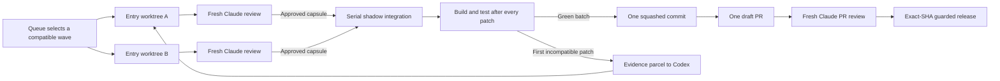

# Pitch: Make the Loop Faster by Making Work Immutable

## Executive summary

The new Road to Send loop establishes the right separation of responsibilities: Codex writes,
Claude reviews, and a deterministic Git guard releases only an approved SHA. Its remaining
bottleneck is how work is represented between those boundaries. Several reviewed entries currently
accumulate in one worktree, using staged state to distinguish the approved batch from the entry
under review. That is efficient while everything goes well, but fragile to interrupted runs and
difficult to parallelize safely.

The next improvement should make an **immutable patch capsule** the unit of work. Each capsule binds
an entry to its base SHA, patch hash, permitted paths, test evidence, and reviewer verdict. Capsules
are produced in isolated worktrees, reviewed independently, and replayed serially through a shadow
integration worktree that tests the cumulative batch after every accepted entry.

This gives the loop safe parallelism, deterministic recovery, smaller context handoffs, and earlier
detection of cross-entry defects without weakening either review gate.

## The opportunity

The current generator/discriminator design already solves the most important quality problem:

- Codex implements and fixes.
- Fresh Claude contexts judge the result and return findings only.
- Detailed Codex traces remain on disk; the orchestrator sees fixed reports.
- Major UI work receives rendered mobile and desktop review.
- A batch becomes one commit and one pull request.
- The Git guard publishes, amends, and releases exact known SHAs.

Three constraints now limit it:

1. **The batch is a mutable worktree.** Approved entries and the current entry share one filesystem
   and are separated through staged versus unstaged state.
2. **Integration feedback arrives late.** Entries are tested independently, but their interaction is
   proved mainly when the batch ships.
3. **Review findings are prose-shaped.** Fix agents receive more context than they need, and progress
   is difficult to distinguish from activity.

Simply adding parallel agents would amplify all three problems. The loop needs durable work identity
and cumulative integration before it needs more concurrency.

## Proposal

### 1. Immutable entry capsules

Every entry produces a versioned manifest containing:

- Entry number and title.
- Immutable base SHA.
- Temporary local commit and patch hash.
- Permitted and actually changed paths.
- Claimed behavioral surfaces such as DOM IDs, globals, localStorage keys, and test harnesses.
- Build and test commands with result digests.
- UI classification.
- Reviewer verdict and finding identifiers.
- Codex session and full-log pointers for recovery.

The capsule contains evidence and identifiers, not conversational reasoning. Any fresh context can
reconstruct exactly what was implemented and what was approved.

### 2. Isolated entry worktrees

Codex implements each entry in a disposable worktree rooted at the batch's immutable base. A fresh
Claude reviewer judges the exact patch hash in another clean context. Failed work stays isolated;
approved work crosses into integration as a sealed patch rather than as mutable filesystem state.

Initial implementation remains serialized. Parallel waves are enabled only after the capsule and
integration mechanisms are proven, and only for entries with no declared dependency or overlapping
surface lease.

### 3. Cumulative shadow integration

Approved capsules are applied in queue order to a dedicated integration worktree. After every
application the loop regenerates `index.html` and runs `npm test`. The integration manifest records
the ordered patch hashes, resulting tree hash, generated-artifact hash, and test outcome.

If entry 103 passes alone but fails after entries 101 and 102, only 103 returns to Codex. The known
green prefix remains intact. Before publication, the final squashed commit must produce the same
relevant tree as the green shadow batch.

### 4. Evidence parcels

Reviewer findings become small, schema-validated parcels:

```text
invariant_id
entry
base_sha
patch_hash
file_and_line
failing_command
evidence_digest
acceptance_delta
full_log_pointer
```

Drain forwards only the parcel. Codex can recover full evidence by pointer when necessary. A fix
round demonstrates progress with a new patch hash, a failing-to-passing test transition, or a
materially narrowed failure. Existing three-round limits remain unchanged.

### 5. Risk-adaptive batching

Keep `BATCH_MAX = 5`, but treat `BATCH_MIN = 3` as a default rather than an unconditional target.
Ship early when a batch contains:

- Overlapping files or behavioral surfaces.
- A major UI entry.
- Multiple fix rounds.
- An unusually large generated-artifact change.
- An integration-order dependency.

Allow larger batches only for small, disjoint, first-pass approvals.

## Target workflow



Parallelism exists only in implementation. Integration, final review, and release remain serial and
deterministic.

## Why this is worth doing

### Higher throughput

- Two independent entries can be implemented concurrently once compatibility rules are proven.
- Review and test evidence can be reused when the base and patch hash have not changed.
- An integration failure returns only the incompatible capsule rather than invalidating the batch.

### Better token efficiency

- Entry capsules replace repeated repository rediscovery.
- Evidence parcels replace free-form finding retransmission.
- Drain retains identifiers and state transitions rather than diffs, transcripts, and test logs.
- Fixes resume the relevant Codex session with precise acceptance criteria.

### Better code quality

- The cumulative batch is tested after every accepted entry.
- Review verdicts bind to immutable patch identity rather than a mutable worktree.
- Generated `index.html` is attested from integration through publication.
- Interaction failures surface while entry-specific context is still recoverable.

### Better recovery

- A crashed orchestrator can resume from capsules and manifests without reconstructing hidden agent
  context.
- Failed worktrees can be quarantined or discarded without touching approved work.
- The last green integration prefix is always known.
- Published SHAs remain protected by the existing Git guard.

## What this proposal does not do

- It does not weaken the full test suite or either independent review gate.
- It does not allow reviewers to edit code.
- It does not replace Git with a custom patch database; temporary commits remain the patch format.
- It does not parallelize dependent entries or final integration.
- It does not add cryptographic signing, a service, a database, or external dependencies.
- It does not change application code, data contracts, the Apps Script backend, or the Pages URL.

## Rollout

### Phase 1 — Structured evidence

Add JSON Schemas for entry capsules and review parcels. Convert one local review/fix cycle while
keeping the existing staged batch and all current gates.

**Exit criterion:** a fresh context can reproduce a reviewed entry and its outstanding findings
from the capsule alone.

### Phase 2 — Shadow integration

Add `scripts/shadow-batch.mjs` and test every approved entry cumulatively in a disposable worktree.
Keep entry implementation serialized.

**Exit criterion:** the shadow manifest identifies the first incompatible entry, and the final
squashed tree matches the green integration tree.

### Phase 3 — Adaptive batching

Compute a small deterministic risk score from overlap, UI scope, fix rounds, and patch size. Use it
to force early shipment; never use model confidence as an input.

**Exit criterion:** batch decisions are explainable from repository evidence and covered by tests.

### Phase 4 — Isolated serial lanes

Replace staged/unstaged entry boundaries with one disposable worktree per entry, still executed one
at a time.

**Exit criterion:** interrupted entry work cannot modify or obscure the approved batch.

### Phase 5 — Bounded parallel waves

Allow two compatible entries to implement concurrently. Apply approved capsules in queue order and
retain serial review-to-integration transitions.

**Exit criterion:** parallel runs demonstrate lower wall-clock time without increasing fix rounds,
integration failures, or reviewer tokens per shipped entry.

## Measures of success

Track these per shipped entry and per batch:

- Wall-clock time from `Todo` to local approval.
- Codex and Claude tokens by workflow stage.
- Reviewer findings per entry and per thousand changed lines.
- Fix rounds before local and PR approval.
- Isolated-pass/cumulative-fail count.
- Work lost or manually reconstructed after interruption.
- Batch size, overlap, and time waiting for shipment.
- Percentage of review context supplied as schemas versus free-form prose.

The change succeeds if it reduces median time and tokens per shipped entry while holding or reducing
integration failures and review rounds. Parallelism alone is not a success metric.

## Risks and controls

| Risk | Control |
|---|---|
| Disjoint files hide semantic coupling | Behavioral surface leases plus mandatory cumulative tests |
| Capsule metadata becomes a second source of truth | Derive it from Git and test output; bind it to base and patch SHAs |
| Shadow results differ from final squash | Require final tree equivalence before publication |
| Parallel work raises merge/review cost | Begin serialized; cap at two lanes; integrate strictly in queue order |
| Schema ceremony costs more than it saves | Keep schemas small and measure tokens before expanding them |
| Patch churn masquerades as progress | Require test movement or a materially narrowed failure, not only a new hash |

## Decision requested

Approve the direction and authorize Phases 1 and 2: structured evidence parcels and cumulative
shadow integration. Treat isolated worktrees and parallel waves as later, measured unlocks rather
than immediate goals.

This sequencing captures the quality, recovery, and token-efficiency gains first. Once work is
immutable and cumulative integration is continuously proven, parallelism becomes a controlled
throughput optimization instead of a new source of uncertainty.
